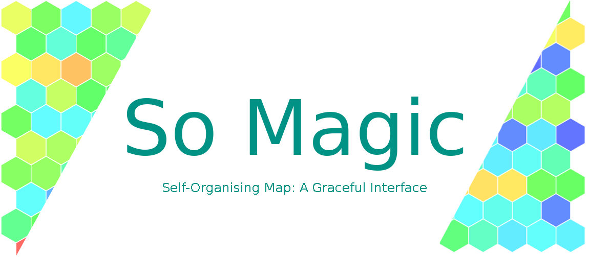

*Self-Organising Map inference, data encoding, high performance, easy to use*

.. start-badges

| |circleci| |travis| |codecov| |docs|
| |release_version| |wheel| |supported_versions| |commits_since|
| |better_code_hub| |codacy| |codeclimate_tech_debt| |scrutinizer_code_quality|

|
| **Documentation:** https://so-magic.readthedocs.io/en/dev
| **Source Code:** https://github.com/boromir674/so-magic
|

So Magic is a Python package (`import so_magic`) that can infer *Self-Organing Map* models, out of structured data.

.. |circleci|  image:: https://img.shields.io/circleci/build/github/boromir674/so-magic/dev?logo=circleci
    :alt: CircleCI
    :target: https://circleci.com/gh/boromir674/so-magic/tree/dev

.. |travis| image:: https://travis-ci.org/boromir674/so-magic.svg?branch=dev
    :alt: Travis-CI Build Status
    :target: https://travis-ci.org/boromir674/so-magic

.. |codecov| image:: https://img.shields.io/codecov/c/github/boromir674/so-magic/mpeta?logo=codecov
    :alt: Codecov
    :target: https://codecov.io/gh/boromir674/so-magic

.. |docs| image:: https://readthedocs.org/projects/so-magic/badge/?version=dev
    :target: https://so-magic.readthedocs.io/en/latest/?badge=dev
    :alt: Documentation Status

.. |release_version| image:: https://img.shields.io/pypi/v/so-magic
    :target: https://pypi.org/project/so-magic/
    :alt: Production Version

.. |wheel| image:: https://img.shields.io/pypi/wheel/so-magic.svg
    :alt: Python Wheel
    :target: https://pypi.org/project/so-magic

.. |supported_versions| image:: https://img.shields.io/pypi/pyversions/so-magic.svg
    :alt: Supported Python versions
    :target: https://pypi.org/project/so-magic

.. |commits_since| image:: https://img.shields.io/github/commits-since/boromir674/so-magic/v0.5.2.svg
    :alt: Commits since latest release
    :target: https://github.com/boromir674/so-magic/compare/v0.5.2..dev

.. |better_code_hub| image:: https://bettercodehub.com/edge/badge/boromir674/so-magic?branch=dev
    :alt: Better Code Hub
    :target: https://bettercodehub.com/

.. |codacy| image:: https://app.codacy.com/project/badge/Grade/319e57e2ec484dce9b953c608f88455d
    :alt: Codacy
    :target: https://www.codacy.com/gh/boromir674/so-magic/dashboard?utm_source=github.com&amp;utm_medium=referral&amp;utm_content=boromir674/so-magic&amp;utm_campaign=Badge_Grade

.. |codacy_branch_quality| image:: https://img.shields.io/codacy/grade/319e57e2ec484dce9b953c608f88455d/mpeta?logo=codacy
    :alt: Codacy branch grade
    :target: https://app.codacy.com/gh/boromir674/so-magic/dashboard?branch=mpeta

.. |codeclimate_tech_debt| image:: https://img.shields.io/codeclimate/tech-debt/boromir674/so-magic?logo=code%20climate
    :alt: Code Climate technical debt

.. |scrutinizer_code_quality| image:: https://img.shields.io/scrutinizer/quality/g/boromir674/so-magic/mpeta?logo=scrutinizer-ci
    :alt: Scrutinizer code quality
    :target: https://scrutinizer-ci.com/g/boromir674/so-magic/?branch=mpeta

To read more about the library (installation guide, features, how-to-use, etc)
please read further in the So Magic `dev documentation <https://so-magic.readthedocs.io/en/dev/>`_.